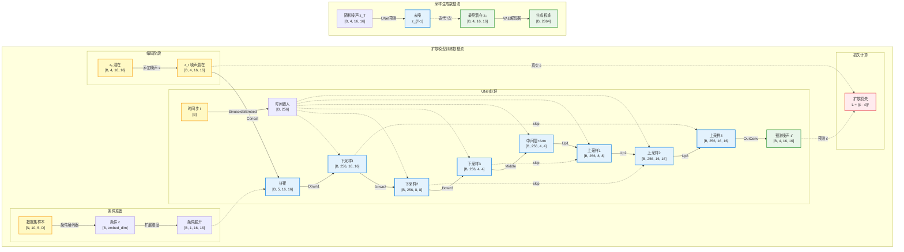
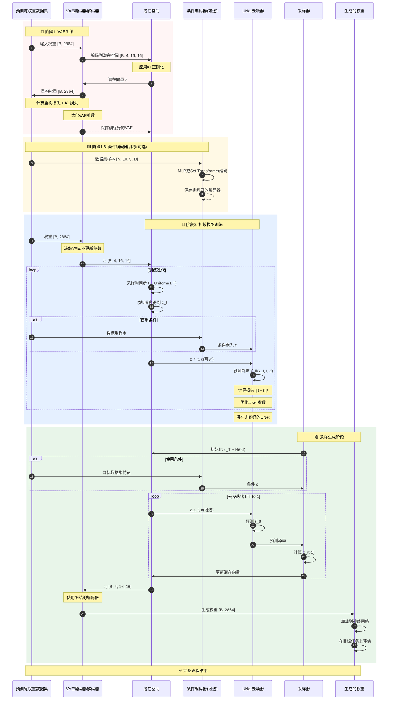

# DNNWG 完整架构可视化 (Mermaid)

本文档使用Mermaid图表语法展示DNNWG框架的完整架构、训练流程和数据流。

> **使用说明**:
> - 在支持Mermaid的Markdown查看器中打开本文档(如GitHub、Typora、VSCode with Mermaid插件)
> - 或复制Mermaid代码块到 [Mermaid Live Editor](https://mermaid.live/) 在线查看
> - 或使用Mermaid CLI工具生成PNG/SVG图片

---

## 目录

1. [完整系统架构图](#1-完整系统架构图)
2. [阶段1: VAE详细架构](#2-阶段1-vae详细架构)
3. [阶段2: 扩散模型详细架构](#3-阶段2-扩散模型详细架构)
4. [训练流程图](#4-训练流程图)
5. [VAE数据流和张量维度](#5-vae数据流和张量维度)
6. [扩散模型数据流和张量维度](#6-扩散模型数据流和张量维度)
7. [条件编码器架构](#7-条件编码器架构)
8. [UNet去噪器详细结构](#8-unet去噪器详细结构)
9. [ResNet Block结构](#9-resnet-block结构)
10. [Self-Attention机制](#10-self-attention机制)
11. [扩散过程详解](#11-扩散过程详解)
12. [完整端到端流程](#12-完整端到端流程)

---

## 1. 完整系统架构图

```mermaid
graph TB
    subgraph Stage1["🔴 阶段1: 变分自编码器 (VAE)"]
        direction LR
        W1[预训练权重<br/>B×2864] --> E1[VAE编码器<br/>Conv+ResNet]
        E1 --> Z1[潜在空间 z<br/>B×4×16×16]
        Z1 --> |KL正则化| KL1[KL散度损失]
        Z1 --> D1[VAE解码器<br/>ResNet+Deconv]
        D1 --> W2[重构权重<br/>B×2864]
        W1 -.重构损失.-> LOSS1[MSE损失]
        W2 -.-> LOSS1
    end

    subgraph Stage2["🔵 阶段2: 潜在扩散模型 (LDM)"]
        direction TB

        subgraph Forward["前向扩散"]
            Z0[z₀ 干净潜在<br/>B×4×16×16] --> |+噪声ε| Z1_noise[z₁]
            Z1_noise --> Z2[z₂]
            Z2 --> ZT[z_T 纯噪声<br/>B×4×16×16]
        end

        subgraph Backward["反向去噪"]
            ZT2[z_T] --> UNET[UNet去噪器<br/>预测噪声ε̂]
            COND[条件嵌入 c] -.条件注入.-> UNET
            TIME[时间步 t] -.-> UNET
            UNET --> ZT_1[z_{T-1}]
            ZT_1 --> |迭代去噪| Z0_gen[z₀ 生成]
        end

        Z0_gen --> DEC2[冻结VAE解码器]
        DEC2 --> WGEN[生成的权重<br/>B×2864]
    end

    subgraph CondEncoder["🟨 条件编码器 (可选)"]
        direction TB
        DS[数据集样本<br/>N×10×5×D] --> |方案1| MLP[MLP编码器<br/>Linear+ReLU]
        DS --> |方案2| SET[Set Transformer<br/>Attention]
        MLP --> COND_OUT[条件嵌入<br/>B×embed_dim]
        SET --> COND_OUT

        subgraph CLIP["CLIP对齐 (可选)"]
            IMG[图像] --> CLIP_IMG[CLIP编码器]
            WEIGHTS[权重] --> VAE_ENC[VAE编码器]
            CLIP_IMG -.对比损失.-> CLIP_LOSS[对比学习损失]
            VAE_ENC -.-> CLIP_LOSS
        end
    end

    %% 连接阶段
    W2 -.VAE训练完成.-> Z0
    COND_OUT --> COND
    CLIP -.对齐训练.-> SET

    %% 样式定义
    classDef vaeStyle fill:#FFE5E5,stroke:#FF6B6B,stroke-width:2px
    classDef diffStyle fill:#E5F0FF,stroke:#45B7D1,stroke-width:2px
    classDef condStyle fill:#FFF9E5,stroke:#FFEAA7,stroke-width:2px
    classDef latentStyle fill:#F0E5FF,stroke:#A29BFE,stroke-width:2px
    classDef lossStyle fill:#FFE5E5,stroke:#FF0000,stroke-width:2px

    class E1,D1,VAE_ENC vaeStyle
    class UNET,ZT,ZT2,ZT_1 diffStyle
    class MLP,SET,COND_OUT,DS condStyle
    class Z1,Z0,Z0_gen latentStyle
    class LOSS1,KL1,CLIP_LOSS lossStyle
```

---

## 2. 阶段1: VAE详细架构

```mermaid
graph TB
    subgraph VAE["变分自编码器 (VAE) 详细结构"]
        direction TB

        subgraph Encoder["🔴 编码器"]
            IN[输入权重<br/>B×2864] --> RESHAPE[Reshape<br/>B×1×64×64]
            RESHAPE --> CONV1[Conv2d<br/>1→128 channels]
            CONV1 --> RES1[ResBlock×2<br/>128 channels]
            RES1 --> DOWN1[Downsample<br/>64×64→32×32]
            DOWN1 --> RES2[ResBlock×2<br/>128 channels]
            RES2 --> DOWN2[Downsample<br/>32×32→16×16]
            DOWN2 --> RES3[ResBlock×2<br/>128→256 channels]
            RES3 --> ATT1[LinearAttention<br/>256 channels]
            ATT1 --> NORM1[GroupNorm<br/>Swish激活]
            NORM1 --> QCONV[Quant Conv<br/>256→8 channels]
            QCONV --> MOMENTS[分布参数<br/>μ, σ]
        end

        subgraph Latent["🟪 潜在空间"]
            MOMENTS --> SAMPLE[重参数化采样<br/>z ~ N(μ, σ²)]
            SAMPLE --> Z[潜在向量 z<br/>B×4×16×16]
            MOMENTS -.-> KLD[KL散度<br/>KL(q||p)]
        end

        subgraph Decoder["🔵 解码器"]
            Z --> PCONV[Post-Quant Conv<br/>4→4 channels]
            PCONV --> NORM2[GroupNorm<br/>Swish激活]
            NORM2 --> RES4[ResBlock×2<br/>256 channels]
            RES4 --> ATT2[LinearAttention<br/>256 channels]
            ATT2 --> RES5[ResBlock×2<br/>256→128 channels]
            RES5 --> UP1[Upsample<br/>16×16→32×32]
            UP1 --> RES6[ResBlock×2<br/>128 channels]
            RES6 --> UP2[Upsample<br/>32×32→64×64]
            UP2 --> RES7[ResBlock×2<br/>128 channels]
            RES7 --> CONV2[Conv2d<br/>128→1 channels]
            CONV2 --> OUT[重构权重<br/>B×1×64×64]
            OUT --> RESHAPE2[Flatten<br/>B×2864]
        end

        subgraph Loss["📊 损失函数"]
            IN -.-> RECON_LOSS[重构损失<br/>MSE/L1]
            RESHAPE2 -.-> RECON_LOSS
            KLD --> TOTAL_LOSS["总损失<br/>L = L_recon + β·L_KL"]
            RECON_LOSS --> TOTAL_LOSS
        end
    end

    classDef encoderStyle fill:#FFE5E5,stroke:#FF6B6B,stroke-width:2px
    classDef decoderStyle fill:#E5FFFF,stroke:#4ECDC4,stroke-width:2px
    classDef latentStyle fill:#F0E5FF,stroke:#A29BFE,stroke-width:2px
    classDef lossStyle fill:#FFEBEE,stroke:#F44336,stroke-width:2px

    class IN,RESHAPE,CONV1,RES1,DOWN1,RES2,DOWN2,RES3,ATT1,NORM1,QCONV,MOMENTS encoderStyle
    class PCONV,NORM2,RES4,ATT2,RES5,UP1,RES6,UP2,RES7,CONV2,OUT,RESHAPE2 decoderStyle
    class SAMPLE,Z latentStyle
    class KLD,RECON_LOSS,TOTAL_LOSS lossStyle
```

---

## 3. 阶段2: 扩散模型详细架构

```mermaid
graph TB
    subgraph LDM["潜在扩散模型 (Latent Diffusion Model)"]
        direction TB

        subgraph Input["输入准备"]
            W_IN[预训练权重] --> FROZEN_ENC[冻结VAE编码器<br/>不更新参数]
            FROZEN_ENC --> Z0[z₀ 干净潜在<br/>B×4×16×16]
        end

        subgraph DiffusionForward["🔴 前向扩散过程"]
            Z0 --> NOISE1[添加噪声 ε₁<br/>ε ~ N(0,I)]
            NOISE1 --> Z1["z₁ = √(1-β₁)z₀ + √β₁·ε₁"]
            Z1 --> NOISE2[添加噪声 ε₂]
            NOISE2 --> Z2[z₂]
            Z2 -.迭代T步.-> ZT[z_T 纯噪声<br/>≈ N(0,I)]
        end

        subgraph ConditionModule["🟨 条件模块"]
            DS_SAMPLES[数据集样本] --> COND_ENC[条件编码器<br/>MLP/SetTransformer]
            COND_ENC --> COND_EMB[条件嵌入 c<br/>B×embed_dim]
        end

        subgraph UNetDenoiser["🔵 UNet去噪器"]
            direction TB
            ZT_IN[z_t 噪声潜在] --> CONCAT[Concat<br/>z_t + c]
            COND_EMB -.-> CONCAT
            T_EMB[时间步嵌入<br/>Sinusoidal] -.-> CONCAT

            CONCAT --> DOWN_BLOCK1[DownBlock 1<br/>256 channels]
            DOWN_BLOCK1 --> DOWN_BLOCK2[DownBlock 2<br/>256 channels]
            DOWN_BLOCK2 --> DOWN_BLOCK3[DownBlock 3<br/>256 channels]

            DOWN_BLOCK3 --> MID_BLOCK[Middle Block<br/>Self-Attention]

            MID_BLOCK --> UP_BLOCK1[UpBlock 1<br/>256 channels]
            DOWN_BLOCK3 -.skip.-> UP_BLOCK1
            UP_BLOCK1 --> UP_BLOCK2[UpBlock 2<br/>256 channels]
            DOWN_BLOCK2 -.skip.-> UP_BLOCK2
            UP_BLOCK2 --> UP_BLOCK3[UpBlock 3<br/>256 channels]
            DOWN_BLOCK1 -.skip.-> UP_BLOCK3

            UP_BLOCK3 --> OUT_CONV[Output Conv<br/>256→4 channels]
            OUT_CONV --> PRED_NOISE[预测噪声 ε̂_θ<br/>B×4×16×16]
        end

        subgraph DiffusionBackward["🟢 反向去噪过程"]
            PRED_NOISE --> DENOISE["去噪公式<br/>z_{t-1} = (z_t - ε̂_θ)/√(1-β_t)"]
            DENOISE --> Z_T1[z_{T-1}]
            Z_T1 -.迭代T步.-> Z0_GEN[z₀ 生成潜在]
        end

        subgraph Output["输出生成"]
            Z0_GEN --> FROZEN_DEC[冻结VAE解码器<br/>不更新参数]
            FROZEN_DEC --> W_GEN[生成的权重<br/>B×2864]
        end

        subgraph TrainingLoss["📊 训练损失"]
            NOISE1 -.真实噪声 ε.-> DIFF_LOSS["扩散损失<br/>L = ||ε - ε̂_θ||²"]
            PRED_NOISE -.预测噪声 ε̂.-> DIFF_LOSS
        end
    end

    classDef forwardStyle fill:#FFEBEE,stroke:#E53935,stroke-width:2px
    classDef backwardStyle fill:#E8F5E9,stroke:#43A047,stroke-width:2px
    classDef unetStyle fill:#E3F2FD,stroke:#1E88E5,stroke-width:2px
    classDef condStyle fill:#FFF9C4,stroke:#FBC02D,stroke-width:2px
    classDef frozenStyle fill:#ECEFF1,stroke:#607D8B,stroke-width:2px,stroke-dasharray: 5 5

    class NOISE1,NOISE2,Z1,Z2,ZT forwardStyle
    class DENOISE,Z_T1,Z0_GEN backwardStyle
    class CONCAT,DOWN_BLOCK1,DOWN_BLOCK2,DOWN_BLOCK3,MID_BLOCK,UP_BLOCK1,UP_BLOCK2,UP_BLOCK3,OUT_CONV,PRED_NOISE unetStyle
    class DS_SAMPLES,COND_ENC,COND_EMB,T_EMB condStyle
    class FROZEN_ENC,FROZEN_DEC frozenStyle
```

---

## 4. 训练流程图

```mermaid
flowchart TD
    START([开始]) --> PREPARE[准备预训练权重数据集]

    subgraph Stage1["🔴 阶段1: VAE训练"]
        PREPARE --> CONFIG1[配置VAE<br/>stage1/configs/base_config_kl.yaml]
        CONFIG1 --> TRAIN_VAE[训练VAE<br/>python main.py]
        TRAIN_VAE --> CHECK_RECON{检查重构质量}
        CHECK_RECON -->|质量不佳| TRAIN_VAE
        CHECK_RECON -->|质量良好| SAVE_VAE[保存VAE检查点<br/>vae_checkpoints/]
    end

    SAVE_VAE --> CLIP_CHOICE{使用Set Transformer?}

    subgraph Stage15["🟨 阶段1.5: CLIP对齐 (可选)"]
        CLIP_CHOICE -->|是| EXTRACT_ENC[提取VAE编码器]
        EXTRACT_ENC --> COMPUTE_COND[计算条件特征<br/>python compute_condition.py]
        COMPUTE_COND --> TRAIN_CLIP[训练CLIP对齐<br/>python cliptrainer.py]
        TRAIN_CLIP --> SAVE_CLIP[保存数据集编码器<br/>checkpoints/set-transformer/]
    end

    CLIP_CHOICE -->|否,使用MLP| STAGE2_START
    SAVE_CLIP --> STAGE2_START

    subgraph Stage2["🔵 阶段2: 扩散模型训练"]
        STAGE2_START[配置扩散模型<br/>stage2/configs/base_config.yaml] --> SET_VAE_PATH[设置VAE检查点路径<br/>first_stage_config.ckpt_path]
        SET_VAE_PATH --> SET_COND_PATH{使用预训练<br/>条件编码器?}
        SET_COND_PATH -->|是| SET_COND[设置编码器路径<br/>cond_stage_config.ckpt_path]
        SET_COND_PATH -->|否,联合训练| TRAIN_DIFF
        SET_COND --> TRAIN_DIFF[训练扩散模型<br/>python dtrainer.py]
        TRAIN_DIFF --> SAVE_DIFF[保存LDM检查点<br/>ldm_checkpoints/]
    end

    subgraph Sampling["🟢 采样阶段"]
        SAVE_DIFF --> LOAD_MODEL[加载训练好的模型]
        LOAD_MODEL --> PREP_COND[准备条件<br/>可选]
        PREP_COND --> SAMPLE[采样生成<br/>python mlp_sampling.py]
        SAMPLE --> TEST[测试生成的权重]
        TEST --> EVAL[评估性能]
    end

    EVAL --> FINISH([完成])

    %% 样式
    classDef stage1Style fill:#FFE5E5,stroke:#FF6B6B,stroke-width:3px
    classDef stage15Style fill:#FFF9E5,stroke:#FBC02D,stroke-width:3px
    classDef stage2Style fill:#E5F0FF,stroke:#45B7D1,stroke-width:3px
    classDef samplingStyle fill:#E8F5E9,stroke:#43A047,stroke-width:3px
    classDef decisionStyle fill:#FFF3E0,stroke:#FF9800,stroke-width:2px

    class CONFIG1,TRAIN_VAE,CHECK_RECON,SAVE_VAE stage1Style
    class EXTRACT_ENC,COMPUTE_COND,TRAIN_CLIP,SAVE_CLIP stage15Style
    class STAGE2_START,SET_VAE_PATH,SET_COND,TRAIN_DIFF,SAVE_DIFF stage2Style
    class LOAD_MODEL,PREP_COND,SAMPLE,TEST,EVAL samplingStyle
    class CLIP_CHOICE,SET_COND_PATH decisionStyle
```



---

## 5. VAE数据流和张量维度

```mermaid
graph LR
    subgraph VAE_DataFlow["VAE编码-解码数据流"]
        direction LR

        A["原始权重<br/>[B, 2864]"] -->|Reshape| B["张量<br/>[B, 1, 64, 64]"]
        B -->|Conv 1→128| C["特征图<br/>[B, 128, 64, 64]"]
        C -->|ResBlock×2| D["特征图<br/>[B, 128, 64, 64]"]
        D -->|Downsample| E["降采样<br/>[B, 128, 32, 32]"]
        E -->|ResBlock×2| F["特征图<br/>[B, 128, 32, 32]"]
        F -->|Downsample| G["降采样<br/>[B, 128, 16, 16]"]
        G -->|ResBlock×2| H["特征图<br/>[B, 256, 16, 16]"]
        H -->|Attention| I["注意力<br/>[B, 256, 16, 16]"]
        I -->|Quant Conv| J["量化<br/>[B, 8, 16, 16]"]

        J -.KL正则化.-> KL["KL散度损失"]

        J -->|采样 z| K["潜在空间<br/>[B, 4, 16, 16]"]

        K -->|Post-Quant| L["反量化<br/>[B, 4, 16, 16]"]
        L -->|ResBlock×2| M["特征图<br/>[B, 256, 16, 16]"]
        M -->|Attention| N["注意力<br/>[B, 256, 16, 16]"]
        N -->|ResBlock×2| O["特征图<br/>[B, 128, 16, 16]"]
        O -->|Upsample| P["上采样<br/>[B, 128, 32, 32]"]
        P -->|ResBlock×2| Q["特征图<br/>[B, 128, 32, 32]"]
        Q -->|Upsample| R["上采样<br/>[B, 128, 64, 64]"]
        R -->|ResBlock×2| S["特征图<br/>[B, 128, 64, 64]"]
        S -->|Conv 128→1| T["重构图<br/>[B, 1, 64, 64]"]
        T -->|Flatten| U["重构权重<br/>[B, 2864]"]

        A -.重构损失.-> LOSS["MSE损失"]
        U -.-> LOSS
    end

    classDef encoderStyle fill:#FFE5E5,stroke:#FF6B6B,stroke-width:2px
    classDef latentStyle fill:#F0E5FF,stroke:#A29BFE,stroke-width:2px
    classDef decoderStyle fill:#E5FFFF,stroke:#4ECDC4,stroke-width:2px
    classDef lossStyle fill:#FFEBEE,stroke:#F44336,stroke-width:2px

    class A,B,C,D,E,F,G,H,I,J encoderStyle
    class K latentStyle
    class L,M,N,O,P,Q,R,S,T,U decoderStyle
    class KL,LOSS lossStyle
```



---

## 6. 扩散模型数据流和张量维度



---

## 7. 条件编码器架构

```mermaid
graph TB
    subgraph ConditionalEncoders["条件编码器架构对比"]
        direction TB

        INPUT["数据集样本<br/>N×10×5×feature_dim<br/>(N个样本,10类,每类5个特征)"]

        subgraph MLP_Encoder["🟡 方案1: MLP编码器 (更快)"]
            direction TB
            INPUT --> FLAT1[Flatten<br/>N×(10×5×feature_dim)]
            FLAT1 --> LINEAR1[Linear Layer<br/>→ 512 dim]
            LINEAR1 --> ACT1[ReLU + BatchNorm]
            ACT1 --> LINEAR2[Linear Layer<br/>→ 1024 dim]
            LINEAR2 --> ACT2[ReLU + Dropout]
            ACT2 --> POOL1[Global Pool<br/>N → B]
            POOL1 --> OUT_MLP[输出嵌入<br/>B×1024]
        end

        subgraph SetTransformer["🟢 方案2: Set Transformer (更强大)"]
            direction TB
            INPUT2["数据集样本<br/>N×10×5×feature_dim"] --> EMBED[Input Embedding<br/>N×50×embed_dim]

            EMBED --> ENC1[Set Encoder<br/>Multi-Head Attention]
            ENC1 --> IND[Inducing Points<br/>学习32个摘要点]
            IND --> ENC2[Set Encoder Layer 2<br/>Self-Attention]

            ENC2 --> DEC1[Set Decoder<br/>Query: [CLS] token]
            DEC1 --> DEC2[Decoder Layer 2<br/>Cross-Attention]

            DEC2 --> POOL2[Pool<br/>N → B]
            POOL2 --> OUT_SET[输出嵌入<br/>B×512]
        end

        subgraph CLIP_Alignment["🔴 CLIP对齐模块 (可选)"]
            direction LR

            subgraph ImageBranch["图像分支"]
                IMG[数据集图像<br/>B×3×224×224] --> CLIP_VIS[CLIP视觉编码器<br/>ViT-B/32]
                CLIP_VIS --> IMG_EMB[图像嵌入<br/>B×512]
            end

            subgraph WeightBranch["权重分支"]
                WEIGHT[预训练权重<br/>B×2864] --> VAE_ENC_FROZEN[冻结VAE编码器]
                VAE_ENC_FROZEN --> WEIGHT_PROJ[权重投影<br/>Linear]
                WEIGHT_PROJ --> WEIGHT_EMB[权重嵌入<br/>B×512]
            end

            IMG_EMB --> CONTRASTIVE["对比损失<br/>InfoNCE"]
            WEIGHT_EMB --> CONTRASTIVE

            CONTRASTIVE --> ALIGNED[对齐的嵌入空间]
        end

        OUT_MLP -.输出.-> FINAL[条件嵌入 c]
        OUT_SET -.输出.-> FINAL
        ALIGNED -.用于训练.-> SetTransformer
    end

    classDef mlpStyle fill:#FFF9C4,stroke:#F9A825,stroke-width:2px
    classDef setStyle fill:#E8F5E9,stroke:#43A047,stroke-width:2px
    classDef clipStyle fill:#FFEBEE,stroke:#E53935,stroke-width:2px
    classDef outputStyle fill:#E1F5FE,stroke:#039BE5,stroke-width:2px

    class FLAT1,LINEAR1,ACT1,LINEAR2,ACT2,POOL1,OUT_MLP mlpStyle
    class EMBED,ENC1,IND,ENC2,DEC1,DEC2,POOL2,OUT_SET setStyle
    class IMG,CLIP_VIS,IMG_EMB,WEIGHT,VAE_ENC_FROZEN,WEIGHT_PROJ,WEIGHT_EMB,CONTRASTIVE,ALIGNED clipStyle
    class FINAL outputStyle
```

---

## 8. UNet去噪器详细结构

```mermaid
graph TB
    subgraph UNet["UNet去噪器详细结构"]
        direction TB

        subgraph InputLayer["输入层"]
            Z_T["噪声潜在 z_t<br/>[B, 4, 16, 16]"] --> CONCAT_COND[Concat条件]
            COND["条件 c<br/>[B, 1, 16, 16]"] -.-> CONCAT_COND
            CONCAT_COND --> INPUT_TENSOR["输入张量<br/>[B, 5, 16, 16]"]

            TIME["时间步 t<br/>[B]"] --> TIME_MLP[Time MLP<br/>Sinusoidal+Linear]
            TIME_MLP --> TIME_EMB["时间嵌入<br/>[B, 256]"]
        end

        subgraph DownPath["🔴 下采样路径"]
            INPUT_TENSOR --> DOWN1_IN[Input Conv<br/>5→256 channels]

            DOWN1_IN --> RES_DOWN1A[ResBlock 1A<br/>256 channels]
            TIME_EMB -.时间注入.-> RES_DOWN1A
            RES_DOWN1A --> RES_DOWN1B[ResBlock 1B<br/>256 channels]
            TIME_EMB -.-> RES_DOWN1B
            RES_DOWN1B --> SKIP1["Skip 1<br/>[B, 256, 16, 16]"]

            SKIP1 --> DOWNSAMPLE1[Downsample<br/>16×16→8×8]
            DOWNSAMPLE1 --> RES_DOWN2A[ResBlock 2A<br/>256 channels]
            TIME_EMB -.-> RES_DOWN2A
            RES_DOWN2A --> RES_DOWN2B[ResBlock 2B<br/>256 channels]
            TIME_EMB -.-> RES_DOWN2B
            RES_DOWN2B --> ATT_DOWN2[Self-Attention<br/>8×8]
            ATT_DOWN2 --> SKIP2["Skip 2<br/>[B, 256, 8, 8]"]

            SKIP2 --> DOWNSAMPLE2[Downsample<br/>8×8→4×4]
            DOWNSAMPLE2 --> RES_DOWN3A[ResBlock 3A<br/>256 channels]
            TIME_EMB -.-> RES_DOWN3A
            RES_DOWN3A --> RES_DOWN3B[ResBlock 3B<br/>256 channels]
            TIME_EMB -.-> RES_DOWN3B
            RES_DOWN3B --> SKIP3["Skip 3<br/>[B, 256, 4, 4]"]
        end

        subgraph MiddleBlock["🟡 中间块"]
            SKIP3 --> MID_RES1[ResBlock Mid 1<br/>256 channels]
            TIME_EMB -.-> MID_RES1
            MID_RES1 --> MID_ATT[Self-Attention<br/>4×4 全局]
            MID_ATT --> MID_RES2[ResBlock Mid 2<br/>256 channels]
            TIME_EMB -.-> MID_RES2
            MID_RES2 --> BOTTLENECK["瓶颈<br/>[B, 256, 4, 4]"]
        end

        subgraph UpPath["🔵 上采样路径"]
            BOTTLENECK --> RES_UP3A[ResBlock 3A<br/>256 channels]
            TIME_EMB -.-> RES_UP3A
            SKIP3 -.skip concat.-> RES_UP3A
            RES_UP3A --> RES_UP3B[ResBlock 3B<br/>256 channels]
            TIME_EMB -.-> RES_UP3B
            RES_UP3B --> UPSAMPLE1[Upsample<br/>4×4→8×8]

            UPSAMPLE1 --> RES_UP2A[ResBlock 2A<br/>256 channels]
            TIME_EMB -.-> RES_UP2A
            SKIP2 -.skip concat.-> RES_UP2A
            RES_UP2A --> RES_UP2B[ResBlock 2B<br/>256 channels]
            TIME_EMB -.-> RES_UP2B
            RES_UP2B --> ATT_UP2[Self-Attention<br/>8×8]
            ATT_UP2 --> UPSAMPLE2[Upsample<br/>8×8→16×16]

            UPSAMPLE2 --> RES_UP1A[ResBlock 1A<br/>256 channels]
            TIME_EMB -.-> RES_UP1A
            SKIP1 -.skip concat.-> RES_UP1A
            RES_UP1A --> RES_UP1B[ResBlock 1B<br/>256 channels]
            TIME_EMB -.-> RES_UP1B
        end

        subgraph OutputLayer["输出层"]
            RES_UP1B --> OUT_NORM[GroupNorm]
            OUT_NORM --> OUT_ACT[Swish]
            OUT_ACT --> OUT_CONV[Conv 256→4<br/>输出预测噪声]
            OUT_CONV --> PRED_NOISE["ε̂_θ(z_t, t, c)<br/>[B, 4, 16, 16]"]
        end
    end

    classDef downStyle fill:#FFEBEE,stroke:#E53935,stroke-width:2px
    classDef midStyle fill:#FFF9C4,stroke:#F9A825,stroke-width:2px
    classDef upStyle fill:#E3F2FD,stroke:#1E88E5,stroke-width:2px
    classDef skipStyle fill:#E8F5E9,stroke:#43A047,stroke-width:2px,stroke-dasharray: 5 5
    classDef timeStyle fill:#F3E5F5,stroke:#8E24AA,stroke-width:2px

    class DOWN1_IN,RES_DOWN1A,RES_DOWN1B,DOWNSAMPLE1,RES_DOWN2A,RES_DOWN2B,ATT_DOWN2,DOWNSAMPLE2,RES_DOWN3A,RES_DOWN3B downStyle
    class MID_RES1,MID_ATT,MID_RES2,BOTTLENECK midStyle
    class RES_UP3A,RES_UP3B,UPSAMPLE1,RES_UP2A,RES_UP2B,ATT_UP2,UPSAMPLE2,RES_UP1A,RES_UP1B upStyle
    class SKIP1,SKIP2,SKIP3 skipStyle
    class TIME,TIME_MLP,TIME_EMB timeStyle
```



---

## 9. ResNet Block结构

```mermaid
graph TB
    subgraph ResNetBlock["ResNet Block详细结构"]
        direction TB

        INPUT["输入 x<br/>[B, C_in, H, W]"] --> MAIN_PATH
        INPUT --> SKIP_PATH

        subgraph MAIN_PATH["🔵 主路径"]
            NORM1[GroupNorm<br/>num_groups=32] --> ACT1[Swish激活<br/>x·σ(x)]
            ACT1 --> CONV1[Conv2d 3×3<br/>C_in→C_out<br/>padding=1]

            CONV1 --> ADD_TIME{添加时间嵌入?}
            TIME_EMB["时间嵌入<br/>[B, C_out]"] -.-> TIME_PROJ[Linear<br/>C_time→C_out]
            TIME_PROJ -.-> ADD_TIME

            ADD_TIME --> NORM2[GroupNorm<br/>num_groups=32]
            NORM2 --> ACT2[Swish激活]
            ACT2 --> DROPOUT[Dropout<br/>p=0.1]
            DROPOUT --> CONV2[Conv2d 3×3<br/>C_out→C_out<br/>padding=1]
            CONV2 --> MAIN_OUT["h<br/>[B, C_out, H, W]"]
        end

        subgraph SKIP_PATH["🟢 Skip连接路径"]
            direction TB
            SKIP_CHOICE{C_in == C_out?}
            SKIP_CHOICE -->|是| IDENTITY[Identity<br/>直接传递]
            SKIP_CHOICE -->|否| CONV_SKIP[Conv2d 1×1<br/>C_in→C_out]
            IDENTITY --> SKIP_OUT
            CONV_SKIP --> SKIP_OUT["x'<br/>[B, C_out, H, W]"]
        end

        MAIN_OUT --> ADD[元素相加<br/>x' + h]
        SKIP_OUT -.-> ADD
        ADD --> OUTPUT["输出<br/>[B, C_out, H, W]"]
    end

    classDef mainStyle fill:#E3F2FD,stroke:#1E88E5,stroke-width:2px
    classDef skipStyle fill:#E8F5E9,stroke:#43A047,stroke-width:2px
    classDef timeStyle fill:#F3E5F5,stroke:#8E24AA,stroke-width:2px
    classDef outputStyle fill:#FFF9C4,stroke:#F9A825,stroke-width:2px

    class NORM1,ACT1,CONV1,NORM2,ACT2,DROPOUT,CONV2,MAIN_OUT mainStyle
    class SKIP_CHOICE,IDENTITY,CONV_SKIP,SKIP_OUT skipStyle
    class TIME_EMB,TIME_PROJ,ADD_TIME timeStyle
    class ADD,OUTPUT outputStyle
```

---

## 10. Self-Attention机制

```mermaid
graph TB
    subgraph SelfAttention["Self-Attention机制详细结构"]
        direction TB

        INPUT["输入特征<br/>[B, C, H, W]"] --> RESHAPE1[Reshape<br/>[B, C, H×W]]
        RESHAPE1 --> TRANSPOSE1["Transpose<br/>[B, H×W, C]"]

        subgraph QKV_Projection["🔵 QKV投影"]
            TRANSPOSE1 --> Q_PROJ[Linear<br/>C→C<br/>Query投影]
            TRANSPOSE1 --> K_PROJ[Linear<br/>C→C<br/>Key投影]
            TRANSPOSE1 --> V_PROJ[Linear<br/>C→C<br/>Value投影]

            Q_PROJ --> Q["Q<br/>[B, H×W, C]"]
            K_PROJ --> K["K<br/>[B, H×W, C]"]
            V_PROJ --> V["V<br/>[B, H×W, C]"]
        end

        subgraph MultiHead["🟡 多头注意力"]
            Q --> Q_SPLIT["Split Heads<br/>[B, num_heads, H×W, C/num_heads]"]
            K --> K_SPLIT["Split Heads<br/>[B, num_heads, H×W, C/num_heads]"]
            V --> V_SPLIT["Split Heads<br/>[B, num_heads, H×W, C/num_heads]"]
        end

        subgraph AttentionCompute["🔴 注意力计算"]
            Q_SPLIT --> MATMUL1[MatMul<br/>Q @ K^T]
            K_SPLIT -.transpose.-> MATMUL1

            MATMUL1 --> SCALE["Scale<br/>÷ √(C/num_heads)"]
            SCALE --> SOFTMAX[Softmax<br/>dim=-1]
            SOFTMAX --> ATT_WEIGHTS["注意力权重<br/>[B, num_heads, H×W, H×W]"]

            ATT_WEIGHTS --> MATMUL2[MatMul<br/>Attention @ V]
            V_SPLIT --> MATMUL2
            MATMUL2 --> ATT_OUT["注意力输出<br/>[B, num_heads, H×W, C/num_heads]"]
        end

        subgraph OutputProjection["🟢 输出投影"]
            ATT_OUT --> CONCAT["Concat Heads<br/>[B, H×W, C]"]
            CONCAT --> OUT_PROJ[Linear<br/>C→C<br/>输出投影]
            OUT_PROJ --> DROPOUT[Dropout<br/>p=0.1]
        end

        subgraph Residual["🟣 残差连接"]
            TRANSPOSE1 -.skip.-> ADD[Add<br/>残差相加]
            DROPOUT --> ADD
            ADD --> NORM[LayerNorm<br/>归一化]
        end

        NORM --> TRANSPOSE2["Transpose<br/>[B, C, H×W]"]
        TRANSPOSE2 --> RESHAPE2["Reshape<br/>[B, C, H, W]"]
        RESHAPE2 --> OUTPUT["输出<br/>[B, C, H, W]"]
    end

    classDef qkvStyle fill:#E3F2FD,stroke:#1E88E5,stroke-width:2px
    classDef headStyle fill:#FFF9C4,stroke:#F9A825,stroke-width:2px
    classDef attStyle fill:#FFEBEE,stroke:#E53935,stroke-width:2px
    classDef outStyle fill:#E8F5E9,stroke:#43A047,stroke-width:2px
    classDef residualStyle fill:#F3E5F5,stroke:#8E24AA,stroke-width:2px

    class Q_PROJ,K_PROJ,V_PROJ,Q,K,V qkvStyle
    class Q_SPLIT,K_SPLIT,V_SPLIT headStyle
    class MATMUL1,SCALE,SOFTMAX,ATT_WEIGHTS,MATMUL2,ATT_OUT attStyle
    class CONCAT,OUT_PROJ,DROPOUT outStyle
    class ADD,NORM residualStyle
```

---

## 11. 扩散过程详解

```mermaid
graph LR
    subgraph DiffusionProcess["扩散过程数学原理"]
        direction TB

        subgraph ForwardProcess["🔴 前向扩散过程 (加噪声)"]
            direction LR
            X0["x₀<br/>(干净数据)"] -->|"β₁"| X1["x₁"]
            X1 -->|"β₂"| X2["x₂"]
            X2 -->|"β₃"| X3["x₃"]
            X3 -.->|"...βₜ..."| XT["x_T<br/>(纯噪声)"]

            FORMULA1["q(x_t|x_{t-1}) = 𝒩(x_t; √(1-βₜ)·x_{t-1}, βₜ·I)"]
            FORMULA2["q(x_t|x₀) = 𝒩(x_t; √ᾱₜ·x₀, (1-ᾱₜ)·I)<br/>其中 ᾱₜ = ∏ᵢ(1-βᵢ)"]

            X0 -.直接采样.-> DIRECT["xₜ = √ᾱₜ·x₀ + √(1-ᾱₜ)·ε<br/>ε ~ 𝒩(0,I)"]
        end

        subgraph BackwardProcess["🔵 反向去噪过程 (生成)"]
            direction LR
            XT2["x_T<br/>(随机噪声)<br/>~ 𝒩(0,I)"] -->|"UNet"| XT_1["x_{T-1}"]
            XT_1 -->|"UNet"| XT_2["x_{T-2}"]
            XT_2 -.->|"...UNet..."| X1_2["x₁"]
            X1_2 -->|"UNet"| X0_2["x₀<br/>(生成数据)"]

            FORMULA3["p_θ(x_{t-1}|x_t) = 𝒩(x_{t-1}; μ_θ(x_t,t), Σ_θ(x_t,t))"]
            FORMULA4["μ_θ(x_t,t) = 1/√(1-βₜ) · [x_t - βₜ/√(1-ᾱₜ)·ε_θ(x_t,t)]"]
        end

        subgraph TrainingObjective["📊 训练目标"]
            direction TB
            LOSS_SIMPLE["简化损失(常用):<br/>L_simple = 𝔼ₜ,ₓ₀,ε [||ε - ε_θ(x_t, t)||²]"]
            LOSS_VLB["变分下界:<br/>L_vlb = 𝔼ₜ,ₓ₀ [D_KL(q(x_{t-1}|x_t,x₀) || p_θ(x_{t-1}|x_t))]"]

            LOSS_SIMPLE -.更稳定.-> TRAINING[实际训练]
            LOSS_VLB -.理论最优.-> TRAINING

            TRAINING --> PREDICT["UNet学习预测:<br/>• 噪声 ε (ε-预测,最常用)<br/>• 数据 x₀ (x₀-预测)<br/>• 得分 ∇log p(x_t) (得分匹配)"]
        end

        subgraph NoiseSchedule["📈 噪声调度"]
            direction LR
            LINEAR["线性调度:<br/>βₜ = β_start + (β_end-β_start)·t/T"]
            COSINE["余弦调度:<br/>ᾱₜ = cos²((t/T+s)/(1+s)·π/2)"]

            LINEAR --> SCHEDULE_CHOICE{选择}
            COSINE --> SCHEDULE_CHOICE
            SCHEDULE_CHOICE --> USED["实际使用的 βₜ 序列"]
        end
    end

    subgraph Sampling["🟢 采样算法"]
        direction TB

        subgraph DDPM_Sampling["DDPM采样 (原始)"]
            DDPM_INIT["初始化: x_T ~ 𝒩(0,I)"] --> DDPM_LOOP["for t=T to 1:"]
            DDPM_LOOP --> DDPM_PRED["  预测噪声: ε̂ = ε_θ(x_t, t)"]
            DDPM_PRED --> DDPM_MEAN["  计算均值: μ = ..."]
            DDPM_MEAN --> DDPM_SAMPLE["  采样: x_{t-1} ~ 𝒩(μ, σ²·I)"]
            DDPM_SAMPLE -.循环.-> DDPM_LOOP
            DDPM_SAMPLE --> DDPM_OUT["输出: x₀"]
        end

        subgraph DDIM_Sampling["DDIM采样 (加速)"]
            DDIM_INIT["初始化: x_T ~ 𝒩(0,I)"] --> DDIM_SUBSET["选择时间步子集<br/>{τ₁,τ₂,...,τₛ} ⊂ {1,...,T}"]
            DDIM_SUBSET --> DDIM_LOOP["for i=S to 1:"]
            DDIM_LOOP --> DDIM_PRED["  预测x₀: x̂₀ = ..."]
            DDIM_PRED --> DDIM_DIRECTION["  方向: dir = √(1-ᾱ_{τᵢ₋₁})·ε̂"]
            DDIM_DIRECTION --> DDIM_NEXT["  确定性更新: x_{τᵢ₋₁} = √ᾱ_{τᵢ₋₁}·x̂₀ + dir"]
            DDIM_NEXT -.循环.-> DDIM_LOOP
            DDIM_NEXT --> DDIM_OUT["输出: x₀<br/>(10-50步即可)"]
        end
    end

    classDef forwardStyle fill:#FFEBEE,stroke:#E53935,stroke-width:2px
    classDef backwardStyle fill:#E3F2FD,stroke:#1E88E5,stroke-width:2px
    classDef lossStyle fill:#FFF9C4,stroke:#F9A825,stroke-width:2px
    classDef samplingStyle fill:#E8F5E9,stroke:#43A047,stroke-width:2px

    class X0,X1,X2,X3,XT,FORMULA1,FORMULA2,DIRECT forwardStyle
    class XT2,XT_1,XT_2,X1_2,X0_2,FORMULA3,FORMULA4 backwardStyle
    class LOSS_SIMPLE,LOSS_VLB,TRAINING,PREDICT lossStyle
    class DDPM_INIT,DDPM_LOOP,DDPM_PRED,DDPM_MEAN,DDPM_SAMPLE,DDPM_OUT,DDIM_INIT,DDIM_SUBSET,DDIM_LOOP,DDIM_PRED,DDIM_DIRECTION,DDIM_NEXT,DDIM_OUT samplingStyle
```



---

## 12. 完整端到端流程



---

## 使用说明

### 在Markdown查看器中查看

1. **GitHub**: 直接在GitHub仓库中打开本文档,Mermaid图表会自动渲染
2. **Typora**: 在Typora中打开,需启用Mermaid支持(偏好设置 → Markdown → Mermaid)
3. **VSCode**: 安装 "Markdown Preview Mermaid Support" 插件
4. **Obsidian**: 原生支持Mermaid语法

### 在线编辑器

访问 [Mermaid Live Editor](https://mermaid.live/):
1. 复制任意图表的Mermaid代码块
2. 粘贴到编辑器
3. 实时预览和编辑
4. 导出为PNG/SVG/PDF

### 生成静态图片

使用Mermaid CLI:

```bash
# 安装Mermaid CLI
npm install -g @mermaid-js/mermaid-cli

# 生成单个图表
mmdc -i DNNWG_VISUALIZATION.md -o output_dir/ -e png

# 或使用Docker
docker run --rm -v $(pwd):/data minlag/mermaid-cli \
  -i /data/DNNWG_VISUALIZATION.md \
  -o /data/output.png
```

### 自定义样式

在Mermaid代码块中添加主题配置:


可用主题: `default`, `dark`, `forest`, `neutral`

---

## 图表说明

| 图表编号 | 图表名称 | 主要内容 | 适用场景 |
|---------|---------|---------|---------|
| 1 | 完整系统架构图 | 三阶段全局视图 | 论文综述、项目介绍 |
| 2 | VAE详细架构 | 编码器-解码器结构 | 技术文档、代码实现 |
| 3 | 扩散模型详细架构 | LDM完整流程 | 深入理解扩散过程 |
| 4 | 训练流程图 | 端到端训练步骤 | 实验复现、教学 |
| 5 | VAE数据流 | 张量维度变化 | 调试、优化 |
| 6 | 扩散模型数据流 | UNet数据处理 | 模型分析 |
| 7 | 条件编码器架构 | MLP vs SetTransformer | 条件生成研究 |
| 8 | UNet详细结构 | U形网络内部 | 模型设计、改进 |
| 9 | ResNet Block | 残差块细节 | 模块实现 |
| 10 | Self-Attention | 注意力机制 | 注意力分析 |
| 11 | 扩散过程详解 | 数学原理+采样算法 | 理论学习、算法优化 |
| 12 | 端到端流程 | 时序交互图 | 整体理解、演示 |

---

## 图表特点

✅ **专业性**: 使用Mermaid标准语法,易于版本控制和协作
✅ **可维护性**: 纯文本格式,方便修改和更新
✅ **可移植性**: 在多种平台和工具中通用
✅ **可扩展性**: 易于添加新模块和细节
✅ **高质量**: 支持导出高分辨率矢量图(SVG)和位图(PNG)

---

## 贡献

欢迎提交改进建议:
- 添加更多细节
- 优化图表布局
- 修正错误
- 翻译为其他语言

---

## 许可

本可视化文档是DNNWG项目的一部分,遵循相同的开源许可协议。
